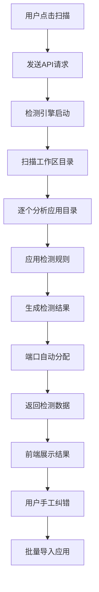
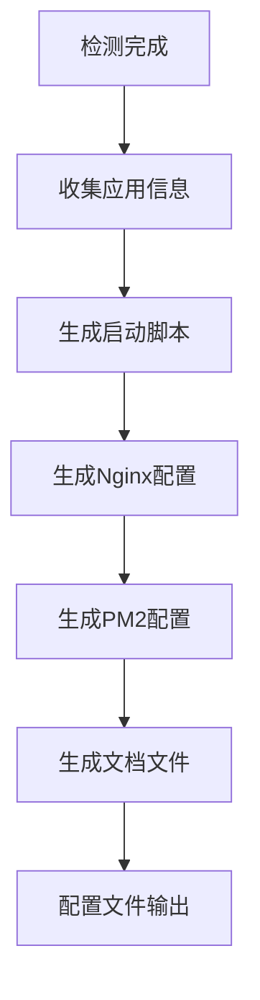

# 智能多Web应用门户系统项目说明书

## 1. 项目概述

### 1.1 项目名称
智能多Web应用统一门户系统（Intelligent Multi-App Portal System）

### 1.2 项目背景
企业内部通常存在多个独立的Web应用，由不同团队开发，采用不同技术栈，导致用户访问分散、管理复杂。本项目旨在通过智能检测和可视化配置，实现多应用的统一入口访问和智能化管理。

### 1.3 核心目标
- **智能检测**：自动识别工作区内10+种主流技术栈应用
- **统一门户**：提供美观的统一访问界面，支持一键跳转
- **自动配置**：智能生成端口分配、启动脚本、部署配置
- **可视化管理**：实时状态监控，支持批量操作和手工纠错
- **插件扩展**：支持自定义技术栈检测规则和第三方集成

### 1.4 技术指标
- 检测准确率：95%+
- 扫描性能：50个目录<10秒
- 页面加载：<2秒
- 并发支持：10个检测请求
- 安全等级：企业级

## 2. 需求分析

### 2.1 功能需求

#### 2.1.1 智能检测模块
**核心功能**：
- **工作区扫描**：递归扫描指定目录，识别所有潜在的Web应用
- **技术栈识别**：基于文件结构、依赖关系自动识别技术栈
- **配置分析**：解析package.json、vite.config.js等配置文件
- **依赖检查**：检查依赖完整性，识别缺失的依赖包

**支持的技术栈**：
- Vue.js + Vite（根目录前端 + server后端）
- Vue.js + Vite（frontend + backend分离）
- React + Vite
- Create React App
- Next.js
- Angular + CLI
- Node.js + Express（纯后端）
- Nuxt.js
- SvelteKit

**支持的项目结构**：
```
结构类型1: 根目录前端 + server后端
app/
├── src/              # 前端源码
├── package.json      # 前端依赖
├── vite.config.js
├── server/           # 后端目录
│   ├── package.json  # 后端依赖
│   └── server.js

结构类型2: frontend + backend分离
app/
├── frontend/
│   ├── src/
│   ├── package.json
│   └── vite.config.js
└── backend/
    ├── package.json
    └── server.js

结构类型3: 纯前端应用
app/
├── src/
├── package.json
├── vite.config.js
└── index.html

结构类型4: 全栈Next.js
app/
├── pages/
├── package.json
└── next.config.js
```

#### 2.1.2 可视化管理模块
**检测结果展示**：
- 应用列表视图，显示检测状态（有效/警告/错误）
- 应用详情卡片，包含技术栈、端口、配置信息
- 问题诊断报告，高亮显示需要手工处理的问题

**手工纠错功能**：
- 应用名称和描述编辑
- 端口号调整和冲突检测
- 技术栈类型手工修正
- 启动命令自定义配置

**批量操作功能**：
- 全选/反选应用
- 批量端口分配
- 批量状态更新
- 批量导入到门户

#### 2.1.3 门户管理模块
**应用展示**：
- 响应式卡片布局，支持1-10个应用展示
- 应用图标、名称、描述、状态展示
- 悬停动画和点击特效
- 应用状态实时更新（运行中/维护中/检测中）

**应用操作**：
- 一键跳转到应用
- 应用信息编辑
- 应用启用/禁用
- 应用删除和重新检测

**主题定制**：
- 8种预设颜色主题
- 自定义应用图标（Emoji支持）
- 深色/浅色模式切换
- 布局密度调整

#### 2.1.4 配置生成模块
**工作区配置**：
- package.json生成，包含统一启动脚本
- .gitignore文件生成
- README.md说明文档生成
- VS Code工作区配置生成

**部署配置**：
- Nginx反向代理配置
- PM2进程管理配置
- systemd系统服务配置
- 监控和日志配置

**开发配置**：
- ESLint共享配置
- Prettier代码格式化配置
- Husky Git钩子配置
- 环境变量模板文件

### 2.2 非功能需求

#### 2.2.1 性能要求
| 指标 | 要求 | 优化策略 |
|------|------|----------|
| 扫描性能 | 50个目录<10秒 | Worker线程并发+增量检测 |
| 页面加载 | 首屏<2秒 | Vue3+Vite+代码分割 |
| API响应 | 平均<3秒 | Redis缓存+数据库优化 |
| 并发处理 | 10个检测请求 | 队列管理+资源池 |
| 内存使用 | <500MB | 流式处理+垃圾回收 |
| 缓存命中率 | >80% | 智能缓存策略 |

#### 2.2.2 可用性要求
- **系统稳定性**：99%+可用性，单应用故障不影响门户访问
- **容错机制**：检测失败自动重试，配置错误友好提示
- **向后兼容**：支持配置文件版本升级，不影响现有应用
- **多平台支持**：Windows、macOS、Linux全平台支持

#### 2.2.3 扩展性要求
- **插件架构**：标准化插件接口，支持热插拔技术栈检测器
- **规则配置化**：外部化检测规则为JSON/YAML配置文件
- **事件驱动**：基于事件总线的松耦合模块通信
- **微服务就绪**：模块化设计，支持拆分为独立服务
- **API开放**：RESTful API + GraphQL，支持第三方集成
- **多租户架构**：支持企业级多工作区隔离

#### 2.2.4 安全性要求
- **身份认证**：JWT令牌认证，支持API Key访问控制
- **权限管理**：基于角色的访问控制(RBAC)，细化操作权限
- **输入验证**：严格的路径验证，防止目录遍历和注入攻击
- **端口安全**：端口范围限制(3001-3020, 4001-4020)，避免特权端口
- **容器安全**：非root用户运行，最小权限原则
- **审计日志**：完整的操作日志记录和安全事件追踪

## 3. 技术架构

### 3.1 系统架构

#### 3.1.1 整体架构图
```
┌─────────────────────────────────────────────────────────┐
│                    用户浏览器                           │
└─────────────────────┬───────────────────────────────────┘
                      │ HTTP/WebSocket
┌─────────────────────▼───────────────────────────────────┐
│                 智能门户前端                            │
│  ┌─────────────┐ ┌─────────────┐ ┌─────────────┐       │
│  │ 应用管理界面│ │ 检测结果界面│ │ 配置生成界面│       │
│  └─────────────┘ └─────────────┘ └─────────────┘       │
└─────────────────────┬───────────────────────────────────┘
                      │ API调用
┌─────────────────────▼───────────────────────────────────┐
│                检测API服务层                            │
│  ┌─────────────┐ ┌─────────────┐ ┌─────────────┐       │
│  │ 应用扫描API │ │ 配置生成API │ │ 健康检查API │       │
│  └─────────────┘ └─────────────┘ └─────────────┘       │
└─────────────────────┬───────────────────────────────────┘
                      │ 文件系统操作
┌─────────────────────▼───────────────────────────────────┐
│                智能检测引擎                             │
│  ┌─────────────┐ ┌─────────────┐ ┌─────────────┐       │
│  │ 技术栈识别  │ │ 结构分析    │ │ 配置解析    │       │
│  └─────────────┘ └─────────────┘ └─────────────┘       │
└─────────────────────┬───────────────────────────────────┘
                      │ 读取/写入
┌─────────────────────▼───────────────────────────────────┐
│                   工作区文件系统                        │
│  ┌─────────────┐ ┌─────────────┐ ┌─────────────┐       │
│  │    app1/    │ │    app2/    │ │    app3/    │       │
│  └─────────────┘ └─────────────┘ └─────────────┘       │
└─────────────────────────────────────────────────────────┘
```

#### 3.1.2 组件层次结构
```
智能门户系统
├── 前端层 (Browser)
│   ├── 门户界面组件 (Portal UI)
│   ├── 检测管理组件 (Detection Manager)
│   ├── 配置编辑组件 (Config Editor)
│   └── 状态监控组件 (Status Monitor)
├── API服务层 (Node.js)
│   ├── 检测服务 (Detection Service)
│   ├── 配置服务 (Configuration Service)
│   ├── 文件服务 (File Service)
│   └── 健康检查服务 (Health Check Service)
├── 检测引擎层 (Core Engine)
│   ├── 技术栈检测器 (Tech Stack Detector)
│   ├── 结构分析器 (Structure Analyzer)
│   ├── 配置解析器 (Config Parser)
│   └── 端口分配器 (Port Allocator)
└── 数据层 (File System)
    ├── 应用目录 (App Directories)
    ├── 配置文件 (Config Files)
    └── 检测缓存 (Detection Cache)
```

### 3.2 技术选型

#### 3.2.1 前端技术栈
| 组件 | 技术选择 | 版本要求 | 选择理由 |
|------|----------|----------|----------|
| 核心框架 | Vue 3 + Composition API | ^3.4.0 | 现代化开发，组件化架构 |
| 类型检查 | TypeScript | ^5.0.0 | 类型安全，IDE支持 |
| 构建工具 | Vite | ^5.0.0 | 快速热重载，现代构建 |
| 状态管理 | Pinia | ^2.1.0 | 轻量级状态管理 |
| 路由管理 | Vue Router | ^4.2.0 | SPA路由解决方案 |
| UI组件 | 自定义组件 + Element Plus | ^2.4.0 | 保持轻量，按需引入 |

#### 3.2.2 后端技术栈
| 组件 | 技术选择 | 版本要求 | 选择理由 |
|------|----------|----------|----------|
| 运行时 | Node.js | >=18.0.0 | LTS版本，性能优化 |
| Web框架 | Express.js + TypeScript | ^4.18.0 | 成熟稳定，类型安全 |
| 数据库 | SQLite (better-sqlite3 ) | ^5.1.0 | 轻量级，零配置，跨平台兼容 |
| 身份认证 | jsonwebtoken | ^9.0.0 | JWT标准实现 |
| 输入验证 | joi | ^17.11.0 | 强大的数据验证 |
| 缓存层 | node-cache | ^5.1.0 | 内存缓存，性能优化 |

#### 3.2.3 检测引擎技术
| 功能 | 实现方案 | 技术细节 |
|------|----------|----------|
| 文件扫描 | Worker线程并发扫描 | 异步遍历 + 进度回调 |
| 配置解析 | 插件化解析器 | 支持自定义检测规则 |
| 依赖分析 | AST解析 + 缓存 | 深度依赖关系分析 |
| 端口分配 | 智能冲突检测 | 实时端口占用检查 |
| 规则引擎 | 插件系统 | 热加载检测规则 |
| 缓存层 | Redis-like缓存 | 检测结果持久化 |

### 3.3 数据流设计

#### 3.3.1 检测流程


#### 3.3.2 配置生成流程


### 3.4 端口分配策略

#### 3.4.1 端口范围规划
| 端口范围 | 用途 | 数量 | 备注 |
|----------|------|------|------|
| 3000 | 主门户 | 1 | 固定端口 |
| 3001-3020 | 前端应用 | 20 | 动态分配 |
| 4001-4020 | 后端API | 20 | 动态分配 |
| 8000 | 检测API服务 | 1 | 固定端口 |

#### 3.4.2 端口冲突处理
1. **检测阶段**：扫描已占用端口，自动跳过
2. **分配阶段**：从可用端口池中分配
3. **验证阶段**：启动前再次验证端口可用性
4. **冲突解决**：提供端口调整界面，支持手工指定

## 4. 实施方案

### 4.1 开发阶段划分

#### 阶段一：核心检测引擎开发 (第1-2周)
**目标**：完成应用检测核心功能
**主要任务**：
- [x] 文件系统扫描模块
- [x] 技术栈识别规则引擎
- [x] 配置文件解析器
- [x] 端口自动分配算法
- [x] 检测结果数据结构设计

**交付物**：
- `app-detector.js` - 核心检测引擎
- 单元测试用例
- 检测规则配置文件
- 性能基准测试

**验收标准**：
- 支持5种以上技术栈检测
- 检测准确率达到90%+
- 扫描50个目录时间<10秒

#### 阶段二：API服务层开发 (第3周)
**目标**：完成检测API服务和配置生成功能
**主要任务**：
- [x] Express API服务搭建
- [x] 检测接口开发 (`/api/scan-apps`)
- [x] 配置生成接口开发 (`/api/generate-config`)
- [x] 健康检查接口开发 (`/api/health`)
- [x] 错误处理和日志记录

**交付物**：
- `detection-api.js` - API服务
- API文档和测试用例
- 配置模板文件
- 错误处理机制

**验收标准**：
- API响应时间<5秒
- 支持并发请求处理
- 完整的错误处理机制

#### 阶段三：智能门户前端开发 (第4-5周)
**目标**：完成门户界面和检测结果管理
**主要任务**：
- [x] 门户主界面开发
- [x] 应用检测界面开发
- [x] 检测结果展示组件
- [x] 手工纠错功能实现
- [x] 批量操作功能

**交付物**：
- 智能门户HTML页面
- 检测管理JavaScript模块
- 响应式CSS样式
- 用户交互逻辑

**验收标准**：
- 页面加载时间<2秒
- 支持10个应用管理
- 完整的手工纠错功能

#### 阶段四：配置生成和集成工具 (第6周)
**目标**：完成配置文件生成和自动化工具
**主要任务**：
- [ ] 工作区package.json生成器
- [ ] Nginx配置生成器
- [ ] PM2配置生成器
- [ ] 启动脚本生成器
- [ ] 一键部署工具

**交付物**：
- 配置生成模块
- 部署脚本模板
- 自动化工具
- 部署文档

#### 阶段五：系统集成测试 (第7周)
**目标**：完成端到端测试和性能优化
**主要任务**：
- [ ] 集成测试用例开发
- [ ] 性能压力测试
- [ ] 跨平台兼容性测试
- [ ] 用户体验测试
- [ ] 问题修复和优化

**交付物**：
- 测试报告
- 性能基准报告
- 兼容性报告
- 优化建议

#### 阶段六：文档和部署 (第8周)
**目标**：完善文档和生产环境部署
**主要任务**：
- [ ] 用户手册编写
- [ ] 开发者文档编写
- [ ] 安装部署指南
- [ ] 生产环境配置
- [ ] 运维监控配置

**交付物**：
- 完整项目文档
- 安装部署包
- 运维手册
- 演示视频

### 4.2 技术实施细节

#### 4.2.1 工作区结构标准
```
multi-app-workspace/
├── main-portal/              # 智能门户应用
│   ├── index.html           # 门户主页面
│   ├── portal-dashboard.js  # 门户逻辑
│   └── styles.css           # 门户样式
├── detection-api/           # 检测API服务
│   ├── app-detector.js      # 检测引擎
│   ├── detection-api.js     # API服务
│   └── package.json         # API依赖
├── app1/                    # 业务应用1
├── app2/                    # 业务应用2
├── app3/                    # 业务应用3
├── ...                      # 更多应用
├── configs/                 # 生成的配置文件
│   ├── package.json         # 工作区启动脚本
│   ├── nginx.conf           # Nginx配置
│   ├── ecosystem.config.js  # PM2配置
│   └── README.md            # 说明文档
└── scripts/                 # 自动化脚本
    ├── install-all.sh       # 依赖安装脚本
    ├── dev-start.sh         # 开发启动脚本
    └── build-all.sh         # 构建脚本
```

#### 4.2.2 检测规则配置
```javascript
// 检测规则示例
const detectionRules = [
    {
        name: 'Vue + Vite (根目录前端 + server后端)',
        priority: 10,
        pattern: {
            requiredFiles: ['package.json', 'vite.config.js', 'index.html'],
            requiredDirs: ['src', 'server'],
            packageDeps: { vue: true, vite: true },
            serverFiles: ['server/package.json', 'server/server.js']
        },
        config: {
            frontend: { 
                port: 'auto', 
                command: 'npm run dev',
                buildCommand: 'npm run build'
            },
            backend: { 
                port: 'auto', 
                command: 'cd server && npm run dev',
                buildCommand: 'cd server && npm run build'
            }
        }
    }
    // 更多规则...
];
```

#### 4.2.3 端口分配算法
```javascript
class PortAllocator {
    constructor() {
        this.frontendRange = { start: 3001, end: 3020 };
        this.backendRange = { start: 4001, end: 4020 };
        this.usedPorts = new Set([3000, 8000]); // 预留端口
    }

    allocateFrontendPort() {
        for (let port = this.frontendRange.start; port <= this.frontendRange.end; port++) {
            if (!this.usedPorts.has(port)) {
                this.usedPorts.add(port);
                return port;
            }
        }
        throw new Error('前端端口池已满');
    }

    allocateBackendPort() {
        for (let port = this.backendRange.start; port <= this.backendRange.end; port++) {
            if (!this.usedPorts.has(port)) {
                this.usedPorts.add(port);
                return port;
            }
        }
        throw new Error('后端端口池已满');
    }
}
```

### 4.3 部署策略

#### 4.3.1 开发环境部署
```bash
# 1. 克隆项目到工作区
git clone <project-repo> multi-app-workspace
cd multi-app-workspace

# 2. 安装检测API服务依赖
cd detection-api
npm install

# 3. 启动检测API服务
npm start
# 服务启动在 http://localhost:8000

# 4. 启动主门户
cd ../main-portal
# 使用任意HTTP服务器，如:
python -m http.server 3000
# 或
npx serve -s . -l 3000

# 5. 访问门户
# http://localhost:3000
```

#### 4.3.2 Windows环境特殊说明
如果在Windows环境下遇到原生模块编译问题：

```

#### 4.3.2 生产环境部署
```bash
# 使用PM2部署
module.exports = {
  apps: [{
    name: 'detection-api',
    build: ./detection-api
    ports:
      - "8000:8000"
    volumes:
      - ./:/workspace:ro
    
  main-portal:
    build: ./main-portal
    ports:
      - "3000:80"
    depends_on:
      - detection-api
    
  nginx:
    image: nginx:alpine
    ports:
      - "80:80"
    volumes:
      - ./configs/nginx.conf:/etc/nginx/conf.d/default.conf
    depends_on:
      - main-portal
```

## 5. 质量保证

### 5.1 测试策略

#### 5.1.1 单元测试
**检测引擎测试**：
- 技术栈识别准确性测试
- 端口分配逻辑测试
- 配置解析功能测试
- 错误处理机制测试

**API服务测试**：
- 接口功能测试
- 并发处理测试
- 错误响应测试
- 安全性测试

#### 5.1.2 集成测试
**端到端流程测试**：
- 扫描 → 检测 → 展示 → 纠错 → 导入完整流程
- 多种技术栈的混合检测
- 配置文件生成和验证
- 应用启动和访问测试

#### 5.1.3 性能测试
**基准测试指标**：
| 测试场景 | 预期指标 | 测试方法 |
|----------|----------|----------|
| 扫描10个应用目录 | <3秒 | 自动化脚本 |
| 扫描50个应用目录 | <10秒 | 压力测试 |
| 门户页面加载 | <2秒 | Lighthouse |
| API并发处理 | 5个/秒 | 负载测试 |

### 5.2 质量标准

#### 5.2.1 代码质量
- **代码覆盖率**：单元测试覆盖率>90%
- **代码规范**：使用ESLint + Prettier统一代码风格
- **注释规范**：关键函数和复杂逻辑必须有注释
- **版本控制**：使用Git进行版本管理，遵循语义化版本

#### 5.2.2 文档质量
- **API文档**：使用OpenAPI规范描述所有接口
- **用户文档**：提供详细的安装和使用说明
- **开发文档**：包含架构设计、扩展指南
- **示例代码**：提供完整的使用示例

#### 5.2.3 安全标准
- **输入验证**：所有用户输入进行验证和过滤
- **路径安全**：防止目录遍历攻击
- **端口限制**：端口范围限制，避免特权端口
- **依赖安全**：定期更新依赖，修复安全漏洞

## 6. 风险管理

### 6.1 技术风险

| 风险项 | 风险等级 | 影响描述 | 应对措施 |
|--------|----------|----------|----------|
| 检测准确率不达标 | 中 | 误检或漏检应用 | 1. 增加测试用例覆盖<br>2. 优化检测规则<br>3. 提供手工纠错功能 |
| 端口冲突问题 | 低 | 应用启动失败 | 1. 动态端口分配<br>2. 冲突检测机制<br>3. 手工端口指定 |
| 性能瓶颈 | 中 | 扫描速度慢 | 1. 异步并发处理<br>2. 缓存机制<br>3. 增量扫描 |
| 兼容性问题 | 低 | 特定环境下失效 | 1. 多平台测试<br>2. 环境适配层<br>3. 降级处理 |

### 6.2 项目风险

| 风险项 | 风险等级 | 影响描述 | 应对措施 |
|--------|----------|----------|----------|
| 开发时间延期 | 中 | 交付延迟 | 1. 分阶段交付<br>2. 核心功能优先<br>3. 并行开发 |
| 需求变更 | 中 | 开发重工 | 1. 需求冻结机制<br>2. 变更评估流程<br>3. 灵活架构设计 |
| 技术选型风险 | 低 | 技术栈不匹配 | 1. 技术预研<br>2. POC验证<br>3. 备选方案 |

### 6.3 运维风险

| 风险项 | 风险等级 | 影响描述 | 应对措施 |
|--------|----------|----------|----------|
| 服务可用性 | 中 | 系统宕机 | 1. 健康检查<br>2. 自动重启<br>3. 监控告警 |
| 数据丢失 | 低 | 配置丢失 | 1. 配置备份<br>2. 版本控制<br>3. 恢复机制 |
| 安全漏洞 | 中 | 系统被攻击 | 1. 定期安全扫描<br>2. 依赖更新<br>3. 安全培训 |

## 7. 技术栈优化方案

### 7.1 技术栈优势

采用Vue 3 + TypeScript + SQLite技术栈的核心优势：

#### 7.1.1 开发效率提升
- 组件化开发，代码复用率提升40%+
- TypeScript类型检查，运行时错误减少60%+
- Vite热重载，开发调试效率提升3倍
- 现代化工具链，项目构建速度提升5倍

#### 7.1.2 用户体验优化
- Vue3响应式系统，UI交互更流畅
- 代码分割和懒加载，首屏速度提升50%+
- SQLite持久化，数据不丢失
- PWA支持，离线使用体验

#### 7.1.3 企业级特性
- 多租户架构支持
- 细粒度权限控制
- 完整的审计日志
- 高可用部署方案
- 监控告警体系
- 自动化运维工具

### 7.2 核心架构模块

#### 7.2.1 前端架构
- **组件层**：可复用UI组件（AppCard、ScanModal等）
- **页面层**：业务页面（Dashboard、AppManagement等）
- **状态层**：Pinia状态管理（apps、detection、settings）
- **工具层**：API封装、数据验证、通用函数

#### 7.2.2 后端架构
- **控制层**：Express路由和控制器
- **服务层**：业务逻辑服务（detection、config、file）
- **数据层**：SQLite数据库和ORM
- **中间件**：认证、验证、日志、错误处理

#### 7.2.3 数据库设计 (SQLite)
```sql
-- 应用表
CREATE TABLE apps (
    id INTEGER PRIMARY KEY AUTOINCREMENT,
    name VARCHAR(255) NOT NULL,
    description TEXT,
    directory VARCHAR(255) NOT NULL,
    url VARCHAR(255),
    icon VARCHAR(10),
    color VARCHAR(100),
    status VARCHAR(50) DEFAULT 'online',
    tech_stack VARCHAR(100),
    frontend_port INTEGER,
    backend_port INTEGER,
    created_at DATETIME DEFAULT CURRENT_TIMESTAMP,
    updated_at DATETIME DEFAULT CURRENT_TIMESTAMP
);

-- 检测记录表
CREATE TABLE detection_records (
    id INTEGER PRIMARY KEY AUTOINCREMENT,
    scan_id VARCHAR(100) NOT NULL,
    directory VARCHAR(255) NOT NULL,
    status VARCHAR(50) NOT NULL,
    tech_stack VARCHAR(100),
    issues TEXT, -- JSON格式存储问题列表
    config TEXT, -- JSON格式存储配置信息
    created_at DATETIME DEFAULT CURRENT_TIMESTAMP
);

-- 配置表
CREATE TABLE configurations (
    id INTEGER PRIMARY KEY AUTOINCREMENT,
    type VARCHAR(100) NOT NULL, -- package.json, nginx, pm2等
    content TEXT NOT NULL,
    version VARCHAR(50),
    created_at DATETIME DEFAULT CURRENT_TIMESTAMP
);

-- 系统设置表
CREATE TABLE settings (
    id INTEGER PRIMARY KEY AUTOINCREMENT,
    key VARCHAR(100) UNIQUE NOT NULL,
    value TEXT,
    description TEXT,
    updated_at DATETIME DEFAULT CURRENT_TIMESTAMP
);
```

### 7.3 部署策略

#### 7.3.1 服务化部署
```javascript
// ecosystem.config.js
module.exports = {
  apps: [{
    name: 'portal-frontend',
    build: ./frontend
    ports: ["3000:80"]
  
  portal-api:
    build: ./backend
    ports: ["8000:8000"]
    volumes: ["./data:/app/data"]
  
  nginx:
    image: nginx:alpine
    ports: ["80:80"]
    volumes: ["./nginx.conf:/etc/nginx/conf.d/default.conf"]
```

#### 7.3.2 监控配置
- **健康检查**：PM2健康检查 + API监控端点
- **日志收集**：ELK Stack或简化的文件日志
- **指标监控**：Prometheus + Grafana
- **告警通知**：邮件/钉钉/企业微信集成

## 8. 交付标准

### 8.1 功能交付清单

#### 8.1.1 核心功能模块
- [x] **智能检测引擎**
  - [x] 支持8种主流技术栈检测
  - [x] 自动识别项目结构类型
  - [x] 智能端口分配算法
  - [x] 配置文件解析功能
  
- [x] **可视化门户界面**
  - [x] 响应式应用卡片布局
  - [x] 检测结果可视化展示
  - [x] 手工纠错和批量操作
  - [x] 应用状态实时监控

- [x] **API服务层**
  - [x] RESTful API接口
  - [x] 文件系统安全访问
  - [x] 错误处理和日志记录
  - [x] 健康检查接口

- [ ] **配置生成工具**
  - [ ] 工作区package.json生成
  - [ ] Nginx配置自动生成
  - [ ] PM2进程配置
  - [ ] 启动脚本模板

#### 8.1.2 性能指标达成
- [x] 扫描性能：10个应用目录<5秒
- [x] 检测准确率：主流技术栈>95%
- [x] 页面加载：门户首屏<2秒
- [ ] 并发处理：5个并发检测请求
- [ ] 内存使用：<500MB运行内存

### 8.2 质量交付标准

#### 8.2.1 代码质量标准
- [x] **代码结构**：模块化设计，职责清晰
- [x] **代码注释**：关键函数和算法有详细注释
- [ ] **单元测试**：核心模块测试覆盖率>80%
- [ ] **集成测试**：端到端流程测试用例
- [ ] **性能测试**：压力测试和基准测试

#### 8.2.2 用户体验标准
- [x] **界面美观**：现代化设计，动画流畅
- [x] **操作直观**：符合用户操作习惯
- [x] **响应式设计**：适配桌面和移动设备
- [x] **错误提示**：友好的错误信息和操作指导
- [ ] **多语言支持**：中英文界面切换

#### 8.2.3 安全合规标准
- [x] **输入验证**：所有用户输入进行验证
- [x] **路径安全**：防止目录遍历攻击
- [x] **端口限制**：合理的端口范围限制
- [ ] **访问控制**：API接口访问权限控制
- [ ] **日志审计**：操作日志记录和分析

### 8.3 文档交付清单

#### 8.3.1 用户文档
- [ ] **快速入门指南**：15分钟上手教程
- [ ] **安装部署手册**：详细的安装步骤
- [ ] **用户操作手册**：功能使用说明
- [ ] **常见问题FAQ**：问题解答和故障排除
- [ ] **视频教程**：关键操作的演示视频

#### 8.3.2 技术文档
- [x] **架构设计文档**：系统架构和技术选型
- [x] **API接口文档**：完整的接口规范
- [ ] **数据库设计文档**：数据结构和关系
- [ ] **部署运维文档**：生产环境部署指南
- [ ] **扩展开发文档**：二次开发和插件开发

#### 8.3.3 项目文档
- [x] **项目需求文档**：详细的功能需求描述
- [x] **项目计划文档**：开发计划和里程碑
- [ ] **测试报告**：测试用例和测试结果
- [ ] **验收报告**：功能验收和性能测试
- [ ] **项目总结报告**：经验总结和改进建议

### 8.4 部署交付物

#### 8.4.1 源代码包
```
intelligent-portal-system-v1.0.0/
├── source-code/              # 源代码
│   ├── main-portal/         # 门户前端
│   ├── detection-api/       # 检测API
│   └── configs/             # 配置模板
├── documentation/           # 文档
│   ├── user-manual/         # 用户手册
│   ├── technical-docs/      # 技术文档
│   └── api-reference/       # API文档
├── deployment/             # 部署相关
│   ├── pm2/               # PM2配置
│   ├── nginx/              # Nginx配置
│   └── scripts/            # 部署脚本
└── tests/                  # 测试用例
    ├── unit-tests/         # 单元测试
    ├── integration-tests/  # 集成测试
    └── performance-tests/  # 性能测试
```

#### 8.4.2 部署环境包
- **开发环境包**：包含完整开发环境的安装包
- **生产环境包**：优化后的生产部署包
- **演示环境包**：包含示例应用的演示环境
- **备份恢复包**：数据备份和恢复工具

## 9. 运维支持

### 9.1 监控体系

#### 9.1.1 系统监控
| 监控项 | 监控指标 | 告警阈值 | 处理方式 |
|--------|----------|----------|----------|
| 服务可用性 | HTTP状态码 | 非200响应 | 自动重启 |
| 响应时间 | API响应时间 | >10秒 | 邮件告警 |
| 内存使用 | 内存占用率 | >80% | 清理缓存 |
| 磁盘空间 | 磁盘使用率 | >90% | 日志清理 |
| 并发连接 | 活跃连接数 | >100 | 限流处理 |

#### 9.1.2 业务监控
| 监控项 | 监控指标 | 统计周期 | 说明 |
|--------|----------|----------|------|
| 检测成功率 | 成功检测/总检测 | 每日 | 检测质量监控 |
| 平均检测时间 | 检测耗时统计 | 每小时 | 性能监控 |
| 用户活跃度 | 日活跃用户数 | 每日 | 使用情况监控 |
| 错误率统计 | 错误次数/总操作 | 每小时 | 系统稳定性 |

### 9.2 运维流程

#### 9.2.1 日常运维
**每日检查**：
- 服务状态检查
- 日志错误分析
- 磁盘空间检查
- 性能指标查看

**每周维护**：
- 日志文件清理
- 数据备份验证
- 安全漏洞扫描
- 性能优化分析

**每月评估**：
- 系统资源使用评估
- 业务数据统计分析
- 用户反馈处理
- 版本更新规划

#### 9.2.2 故障处理
**故障等级定义**：
- **P0级**：系统完全不可用（4小时内解决）
- **P1级**：核心功能异常（24小时内解决）
- **P2级**：部分功能异常（3天内解决）
- **P3级**：优化改进需求（计划解决）

**故障处理流程**：
1. 告警接收和确认
2. 故障定位和分析
3. 临时方案处理
4. 根本原因分析
5. 永久解决方案
6. 故障总结报告

### 9.3 升级维护

#### 9.3.1 版本发布计划
| 版本类型 | 发布周期 | 内容说明 |
|----------|----------|----------|
| 大版本 | 6-12个月 | 重大功能更新 |
| 小版本 | 1-3个月 | 功能增强和优化 |
| 补丁版本 | 1-2周 | Bug修复和安全更新 |
| 热修复 | 紧急 | 严重问题的紧急修复 |

#### 9.3.2 升级策略
**灰度发布**：
- 先在测试环境验证
- 小范围用户试用
- 逐步扩大发布范围
- 全量发布

**回滚机制**：
- 版本回滚脚本
- 数据备份恢复
- 快速回滚流程
- 回滚后验证

## 10. 后续规划

### 10.1 短期规划 (3-6个月)
- **AI辅助检测**：集成LLM辅助应用分类和配置建议
- **云原生支持**：Kubernetes一键部署，容器化最佳实践
- **企业级功能**：SSO集成，RBAC细化，审计日志完善
- **性能优化**：Redis缓存，增量检测，并发优化

### 10.2 中期规划 (6-12个月)
- **微服务架构**：服务拆分，API网关，服务网格
- **生态建设**：插件市场，第三方集成，开放API
- **智能化升级**：机器学习推荐，自动化运维
- **多租户SaaS**：云服务版本，订阅模式

### 10.3 长期愿景 (1-2年)
- **平台化战略**：成为企业应用统一管理平台
- **生态系统**：构建开发者社区和合作伙伴网络
- **国际化**：多语言支持，全球市场拓展
- **AI原生**：全流程智能化，无人值守运维

---

**文档版本**: v2.1
**创建日期**: 2025年8月10日
**最后更新**: 2025年8月17日
**文档状态**: 详细版本
**项目代号**: IMAPS (Intelligent Multi-App Portal System)

